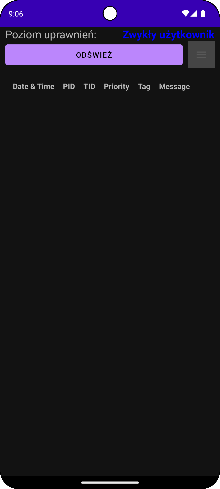
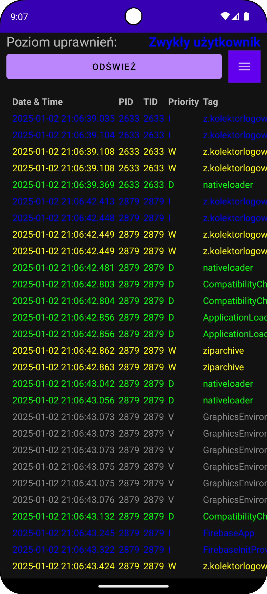
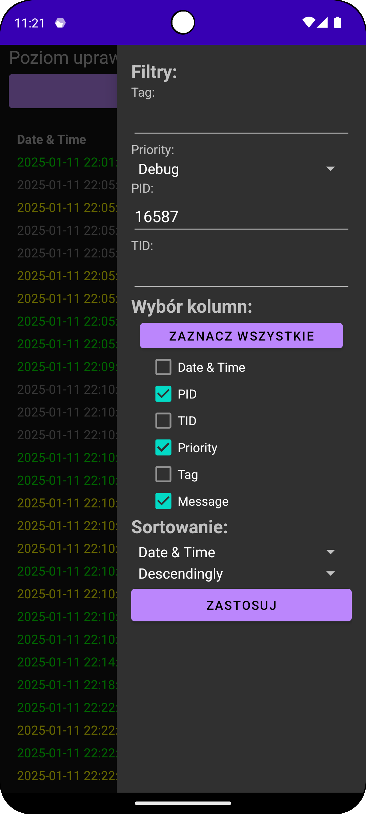

# 📱 LogCollector

**LogCollector** is an Android application designed to collect and manage Android system logs directly on the device. The app enables log filtering, sorting, and uploading to Firestore for remote storage and analysis.

This tool is especially useful in environments where monitoring multiple Android devices (e.g. company fleet phones) is essential for diagnostics and oversight.

---

## 📷 Screenshots

| Main Screen                           | Log Details                          | Settings Bar                              |
|---------------------------------------|--------------------------------------|-------------------------------------------|
|   |  |  |


---

## 🧩 Architecture Diagram


---

## 🚀 Features

- 🧾 Displays system logs in a sortable, scrollable table view.
- 🔍 Filters logs by tag, priority, or PID.
- ⚙️ Adjustable settings panel via right-side sliding drawer.
- 📡 Uploads logs to Firestore cloud database.
- 🔐 Accesses ADB shell commands via **Shizuku**, allowing advanced log access without root.

---

## ⚙️ Tech Stack

- **Languages**: Java, XML
- **Libraries and tools**: Shizuku API, Firestore API, Lombok, RootBeer
- **Data Transfer**: Firestore (Firebase)

---

## 📁 Project Structure

```
LogCollector/
├── app/                      # Main Android application
│   ├── java/                 # Source files
│   ├── res/                  # Layouts, strings, etc.
├── screenshots/              # UI screenshots
├── docs/                     # Architecture diagrams 
├── build.gradle              # Build configuration
└── README.md                 # Project overview
```

---

## 🧪 How to Run

1. Clone the repository:
   ```bash
   git clone https://github.com/thekosa/LogCollector.git
   ```
2. Open the project in Android Studio. 
3. Build and run the app on your test device (min. API 26+ recommended).

---

## 👨‍🎓 Background

This app was created as part of an engineering thesis. Its purpose is to simplify remote log analysis from Android devices without requiring root, using the Shizuku API for extended shell-level access.

Key challenges addressed:
- Shell-level command execution on unrooted devices.
- Real-time log handling and UI rendering.
- Firebase integration for remote data persistence.

---

## 🧑‍💻 Author

Michał Kosieradzki</br>
GitHub: [@thekosa](https://github.com/thekosa)</br>
Repository: [github.com/thekosa/LogCollector](https://github.com/thekosa/LogCollector)

---

## 📌 Notes

- This repository only includes the Android component of the system.
- The companion web viewer (if applicable) is hosted separately or described in documentation.
- This project was developed for educational and demonstration purposes.
